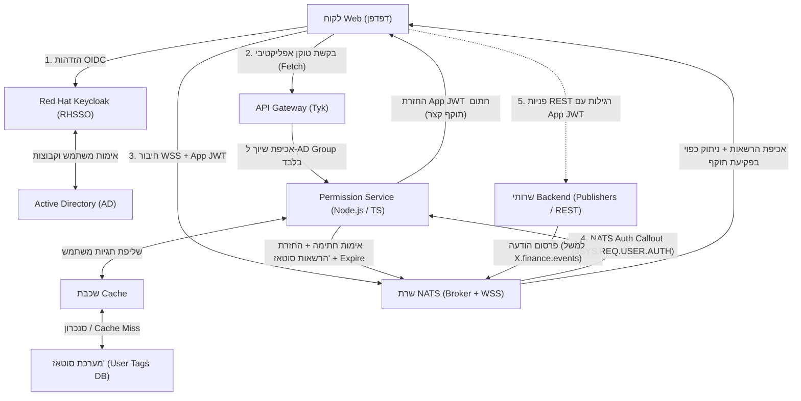
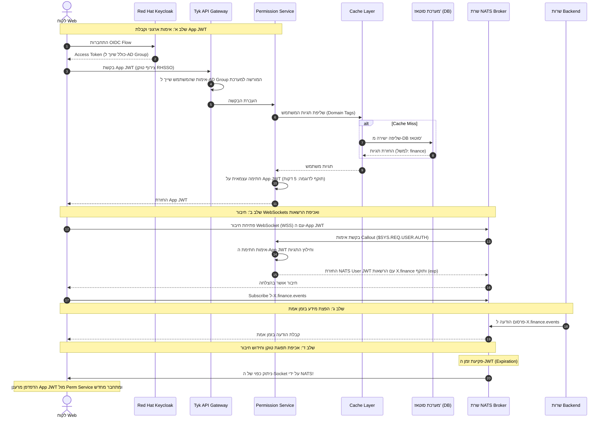

## 1. סקירה מנהלית (Executive Summary)

מסמך זה מגדיר את הארכיטקטורה להפצת נתונים בזמן אמת בשרשור שרתי WebSockets (`wss://`) ללקוחות קצה. 

הארכיטקטורה מפרידה בין:
1. **הזדהות ארגונית וסינון כניסה בסיסי (Gatekeeping):** מתבצע באמצעות **Active Directory (AD)** ו-**Red Hat Keycloak (RHSSO / RHCK)** מול ה-API Gateway מסוג **Tyk**, המוודא שהמשתמש שייך לקבוצת ה-AD הארגונית הרלוונטית בלבד.
2. **ניהול הרשאות עסקיות מבוסס תגיות (Business Domain Authorization):** מתבסס על **מערכת "סוטאז'"** המנהלת תגיות (למשל: `"finance"`) ברמת ה-DB שלה, לצד שכבת **Cache** קיימת לביצועים.
3. **הנפקת ואימות טוקנים (App/Domain JWT):** שירות **Permission Service** (ב-Node.js/TypeScript) שולף את התגיות מסוטאז' (דרך ה-Cache), ומנפיק טוקן JWT אפליקטיבי חתום עצמאית בעל תוקף קצר (מספר דקות). טוקן זה משמש הן לפניות ה-Fetch/REST בשאר חלקי המערכת והן לאימות מול NATS.
4. **מערכת המסרים ואכיפת זמן אמת (NATS):** שרת NATS מאמת את הטוקן באמצעות **NATS Auth Callout** מול ה-Permission Service. שרת NATS עצמו **אוכף את תפוגת הטוקן ברמת ה-Broker ומנתק באופן יזום לקוחות שתוקפם פג**, כדי למנוע ממשתמש זדוני להחזיק Socket פתוח ללא הרשאה עדכנית.

---

## 2. דיאגרמת ארכיטקטורת המערכת



---

## 3. זרימת התהליך מקצה לקצה (Sequence Flow)



---

## 4. רכיבי המערכת ותפקידם

### 4.1 Active Directory, RHSSO ו-Tyk (Gatekeeping & Perimeter Defense)
- **Active Directory (AD):** מנהל את קבוצות המשתמשים בארגון ברמה הרחבה.
- **Red Hat Keycloak (RHSSO):** מנפיק OIDC Token ראשוני וממפה את קבוצות ה-AD.
- **Tyk API Gateway:** 
  - מהווה שער כניסה לבקשות המגיעות מהדפדפן.
  - מוודא אך ורק שהמשתמש שייך ל-**AD Group המורשית להשתמש במערכת**. 
  - **אינו** בודק או מנהל הרשאות אפליקטיביות או תגיות עסקיות.

### 4.2 מערכת סוטאז' ושכבת ה-Cache (Domain Authorization Authority)
- **מערכת סוטאז':** מנהלת את פרטי המשתמשים הייעודיים ל-Domain העסקי ב-DB שלה, כולל תגיות דינמיות כגון `finance`, `ops` וכו'.
- **שכבת ה-Cache:** מאחסנת את תגיות המשתמשים שנשלפו מסוטאז' לפרקי זמן מוגדרים כדי למנוע עומס על מסד הנתונים של סוטאז' בעת רענוני טוקנים תכופים.

### 4.3 שירות ההרשאות (Permission Service - Node.js / TS)
- **מנפיק App JWT:**
  - מקבל פניות Fetch מהלקוח (שעברו אימות ראשוני ב-Tyk).
  - מושך את התגיות העדכניות מה-Cache/סוטאז'.
  - חותם עצמאית על **App JWT** בעל תוקף קצר (מספר דקות). טוקן זה כולל את ה-`userId`, התגיות העסקיות (למשל `tags: ["finance"]`), ומועד תפוגה (`exp`).
  - ה-App JWT משמש את הלקוח לכלל בקשות ה-REST/Fetch במערכת.
- **NATS Auth Callout Provider:**
  - מקשיב לערוץ האימות המובנה של NATS: `$SYS.REQ.USER.AUTH`.
  - מקבל את ה-App JWT שהדפדפן שלח בחיבור ה-WebSocket.
  - מאמת את החתימה והתוקף של ה-JWT של עצמו.
  - ממיר את התגיות להרשאות NATS מדויקות (למשל `allow_sub: ["X.finance.>"]`).
  - מייצר NATS User JWT החתום ע"י ה-Account NKey, **ומוגדר בו שדה `exp` זהה לתפוגת ה-App JWT**.

### 4.4 שרת NATS (Message Broker & Enforcement Engine)
- מאזין לחיבורי WebSockets מאובטחים (`wss://`).
- מעביר את בקשת האימות הראשונית ל-Permission Service דרך Auth Callout.
- **אכיפת אבטחה ברמת ה-Broker (Strict Server-Side Expiration):**
  - שרת NATS מפקח על תוקף הטוקן של כל חיבור.
  - כאשר תוקף ה-JWT מסתיים, **NATS מנתק את ה-WebSocket באופן יזום מצידו**, כך שמשתמש זדוני אינו יכול לשמור על Socket פתוח מעבר לזמן שהוגדר לו.

---

## 5. דוגמאות קוד והגדרות

### 5.1 שירות ההרשאות - הנפקה ואימות (Permission Service - Node.js / TS)

```typescript
import { connect, JSONCodec } from "nats";
import jwt from "jsonwebtoken";
import { createUserJwt, fromSeed } from "nats-jwt";

const jc = JSONCodec();
const APP_JWT_SECRET = process.env.APP_JWT_SECRET || "internal-secret-key";
const ACCOUNT_NKEY_SEED = process.env.NATS_ACCOUNT_SEED!; // NKey Seed לחתימת NATS

// 1. נקודת קצה להנפקת טוקן אפליקטיבי (Fetch / Refresh)
export async function handleTokenRequest(userId: string, tagsFromCache: string[]) {
  const payload = {
    sub: userId,
    tags: tagsFromCache, // למשל: ["finance"]
  };
  
  // חתימה על App JWT בעל תוקף קצר (למשל 5 דקות)
  return jwt.sign(payload, APP_JWT_SECRET, { expiresIn: "5m" });
}

// 2. האזנה ל-NATS Auth Callout
export async function startNatsAuthCallout() {
  const nc = await connect({ servers: "nats://localhost:4222" });
  const sub = nc.subscribe("$SYS.REQ.USER.AUTH");

  for await (const msg of sub) {
    const req = jc.decode(msg.data) as any;
    const clientToken = req.connect_opts?.token;

    try {
      // א. אימות עצמאי של ה-App JWT
      const decoded = jwt.verify(clientToken, APP_JWT_SECRET) as { sub: string; tags: string[]; exp: number };

      // ב. גזירת הרשאות סוטאז' ל-NATS Subjects
      const allowSub = decoded.tags.map(tag => `X.${tag}.>`);

      // ג. יצירת NATS User JWT עם תוקף זהה (exp) לאכיפת ניתוק ע"י NATS!
      const userKeyPair = fromSeed(new TextEncoder().encode(ACCOUNT_NKEY_SEED));
      const natsUserJwt = await createUserJwt({
        name: decoded.sub,
        sub: userKeyPair.publicKey,
        account: userKeyPair.publicKey,
        exp: decoded.exp, // NATS ינתק את ה-Socket ברגע ש-exp מגיע
        permissions: {
          sub: { allow: allowSub },
          pub: { allow: [] } // לקוחות Web הם Read-Only
        }
      }, userKeyPair);

      // ד. אישור החיבור ל-NATS
      msg.respond(jc.encode({ user_jwt: natsUserJwt }));
    } catch (err) {
      // טוקן לא תקף או פג תוקף - דחיית החיבור
      msg.respond(jc.encode({ error: "Unauthorized / Token Expired" }));
    }
  }
}
```

### 5.2 לקוח ה-Web ואסטרטגיית ה-Reconnect (`nats.ws`)

הדפדפן מוגדר להתחבר מחדש אוטומטית כאשר NATS מנתק את ה-Socket עם פקיעת התוקף. בעת החיבור מחדש מועבר הטוקן המרוענן, וספריית `nats.ws` משחזרת אוטומטית את ההרשמות (Subscriptions):

```typescript
import { connect } from "nats.ws";

// פונקציה שמחזירה תמיד את ה-App JWT העדכני ביותר (לאחר Refresh מול ה-Permission Service)
async function getFreshAppJwt(): Promise<string> {
  return await authClient.getValidToken(); 
}

export async function initNatsConnection() {
  const nc = await connect({
    servers: "wss://nats.example.com:9222",
    token: await getFreshAppJwt(),
    // הגדרת Auto-Reconnect בעת ניתוק יזום ע"י שרת NATS בפקיעת תוקף
    reconnect: true,
    maxReconnectAttempts: -1,
    reconnectTimeWait: 1000,
  });

  // הרשמה לערוץ רלוונטי
  const sub = nc.subscribe("X.finance.events");
  (async () => {
    for await (const msg of sub) {
      console.log("התקבל אירוע כספי:", msg.json());
    }
  })();
}
```

---

## 6. מטריצת אבטחה (Security Matrix)

|**תרחיש**|**Tyk (AD Group)**|**תגיות סוטאז' (DB / Cache)**|**הרשאה ב-NATS User JWT**|**תוצאה ב-NATS Broker**|
|---|---|---|---|---|
|**משתמש מורשה בעל תגית**|שייך לקבוצה הארגונית|`["finance"]`|`allow_sub: ["X.finance.>"]`|**הודעות מתקבלות בהצלחה**|
|**משתמש ללא תגית מתאימה**|שייך לקבוצה הארגונית|`["ops"]`|`allow_sub: ["X.ops.>"]`|**הרשמה ל-finance נחסמת ע"י ה-Broker**|
|**פקיעת תוקף הטוקן (Expiration)**|תקף|תקף|`exp: <timestamp>` עבר|**NATS מנתק כפויה את ה-Socket מיידית**|
|**עובד שנשלל מסוטאז'**|שייך לקבוצה הארגונית|נשלל (עודכן ב-Cache)|הטוקן הבא לא יכיל את התגית|**ב-Reconnect הבא (תוך דקות) הגישה נחסמת**|
|**משתמש מחוץ ל-AD Group**|**נחסם ב-Tyk**|-|-|**אינו מגיע כלל ל-Permission Service**|
|**ניסיון פרסום מהדפדפן**|מורשה|כל תגית|`allow_pub: []`|**חסום לחלוטין (Read-Only)**|

---

## 7. סיכום יתרונות הארכיטקטורה

1. **אבטחת Zero-Trust ברמת ה-Broker:** NATS אינו סומך על הלקוח ומנתק בעצמו כל חיבור שתוקף הטוקן שלו עבר, ובכך מנטרל סיכוני "Socket זדוני קבוע".
2. **אחידות טוקנים (Unified App JWT):** אותו JWT חתום משמש לפעולות Fetch/REST מול שאר המערכת ומול NATS, ללא פיצול מזהים.
3. **הפרדת תחומי אחריות (Separation of Concerns):**
   - **Tyk:** שומר סף ארגוני (Perimeter Gatekeeper).
   - **סוטאז' + Cache:** ניהול מידע עסקי ייעודי לדומיין.
   - **Permission Service:** מנפיק ומאמת טוקנים עצמאי.
   - **NATS:** הפצת נתונים וסינון הודעות בביצועי זיכרון מקסימליים.
4. **עמידות בעומסים:** שכבת ה-Cache מול סוטאז' מונעת קריסות של מסד הנתונים גם במחזורי Refresh תכופים של אלפי משתמשים.